# Challange Alura Stores

## Atividade faz parte da formação Modelagem de Dados com Python G8 - ONE do curso  ONE Tech Fundation - Especialização Data Science

## Parceria da Alura com Oracle Next Education

## Descrição do Desafio

### A Alura Store possui 4 lojas e precisa vender uma das lojas para capitalizar a empresa

### Com base nas análises dos dados disponibilizados foi orientado a venda da Loja 4

### Abaixo detalhamento da análise

> Os dados fornecidos compreendem o período de janeiro de 2020 à março de 2023

### Ranking de Faturamento
> Embora no ano de 2020 a Loja estivesse em 2° lugar nas vendas, nos anos de 2021 e 2022, ficou em último lugar e aponta para mesma situação nos três primeiros meses de 2023
>
 

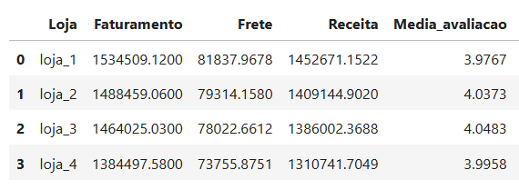

 

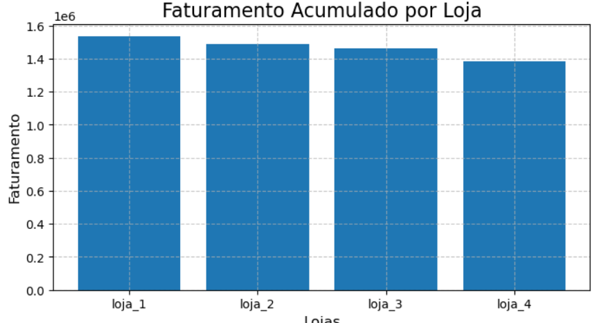

 

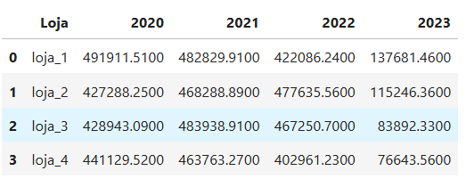

 

> Nos últimos 12 meses loja teve a pior faturamento em 8 meses
 

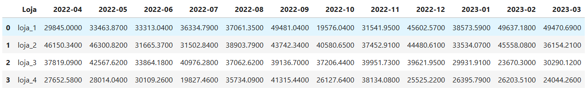
 

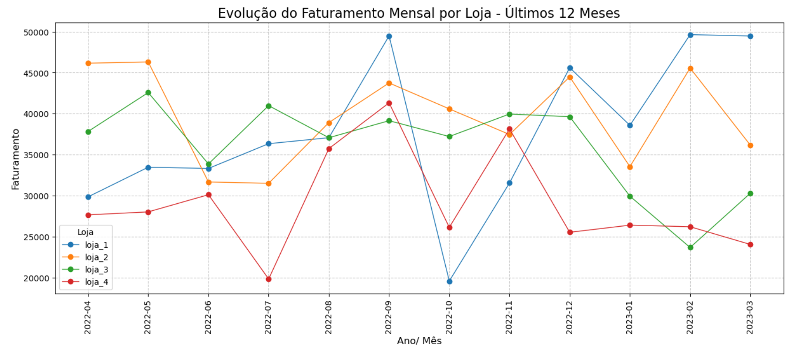
 

>
> A loja tem pior desempenho em 4 das 8 categorias de produtos no Faturamento acumulado

 

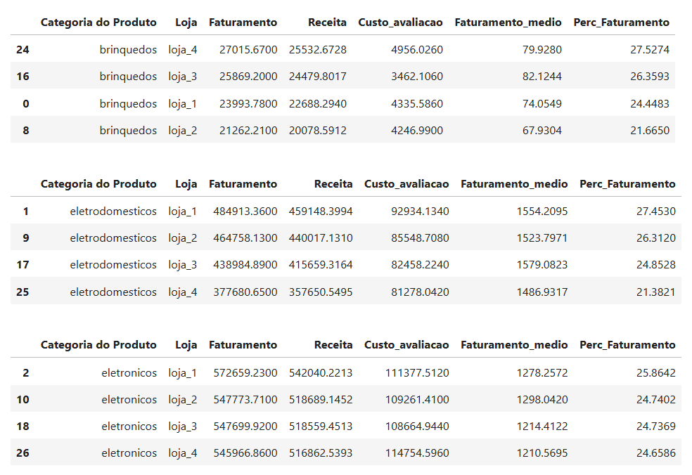
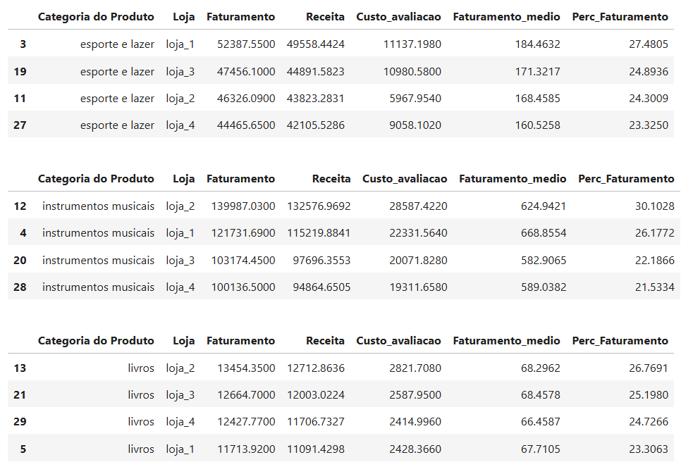
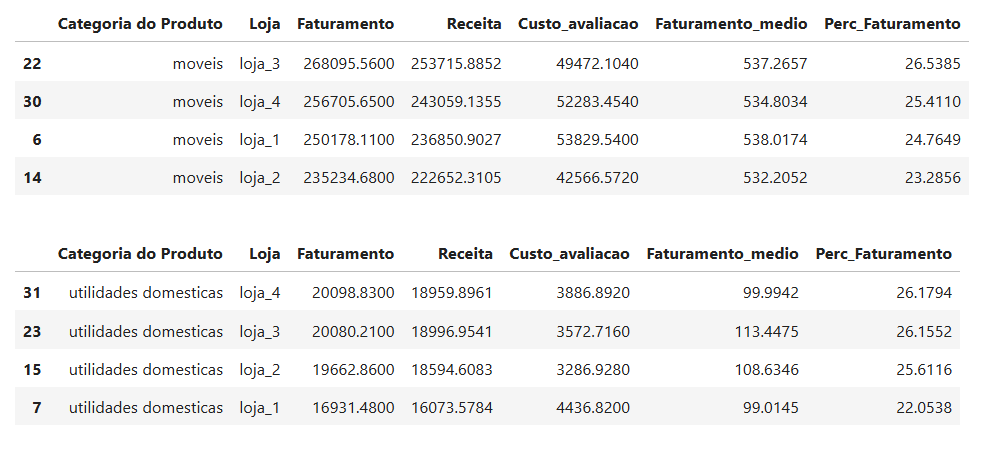

 

### Variação de Faturamento em relação ao ano anterior
> Em 2021 e 2023 a loja foi a 3° colocada em % de variação de faturamento em relação ao ano anterior
>
> Em 2022, a loja apresenta a pior variação em relação ao ano anterior
 

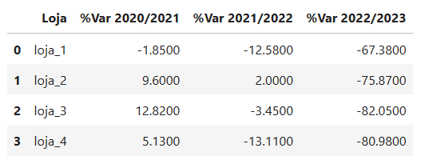

### Avaliação dos Compradores
> Na média consolidada a loja está em 3° lugar na avaliação de compra dos clientes
>
> Mesmo considerando uma métrica ponderada da avaliação pelo faturamento, a loja também está em 3° lugar na avaliação ponderada

 

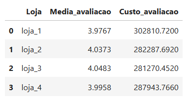

### Vendas por Produtos
> Considerando a qunatidade de itens no top 20 de venda acumulada de produtos, a loja está em último lugar
 

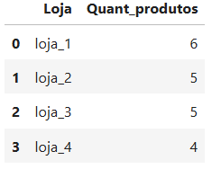

### Ranking de Receitas
> Foi criado um ranking de Receita considerando o valor do Faturamento menos Frete. Embora a loja tenho uma vantagem muito pequena em relação ao % de Frete, é a última colocada em Receitas

 

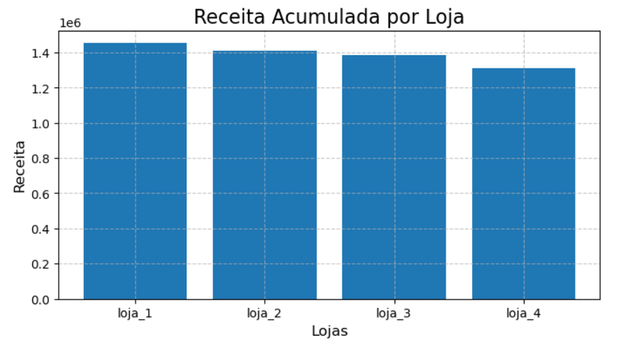

## Exceções de desempenho

### Embora a loja 4 de um modo geral tenha desempenho abaixo das demais lojas nos indicadores analisados, foram identificadas algumas exceções

### Vendas por Produtos
> Considerando a qunatidade de itens no 100 da venda acumulada de produtos, a loja está em primeiro lugar juntamente com a Loja 3

 

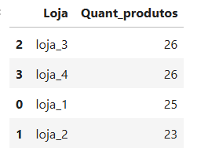

### Frete das Compras
> Embora quase todas as lojas estejam empatadas, a loja apresenta uma pequena liderança no % de Frete sobre o Faturamento

 

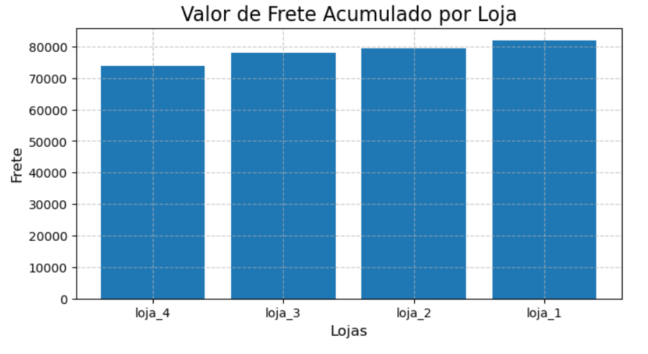

 

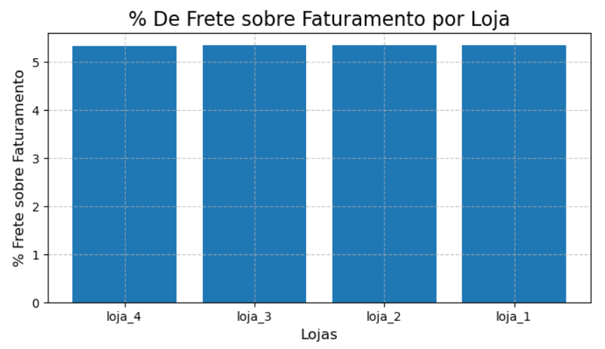